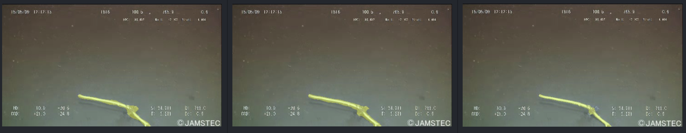
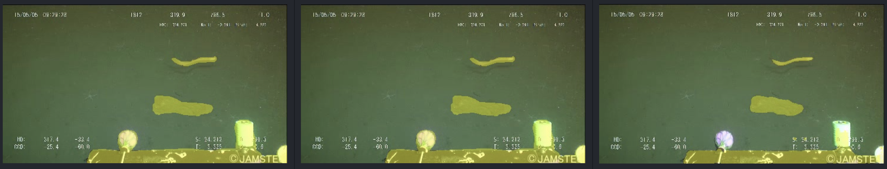

# Lightning Segment-Anything Model

This library allows you to fine-tune the powerful Segment-Anything model from MetaAI for your custom COCO-format datasets. The library is built on top of Lightning AI's Fabric framework, providing an efficient and easy-to-use implementation for achieving state-of-the-art instance segmentation results.

This repo is an experiment; A PoC to see if fine-tuning SAM using bounding boxes as prompts would increase the IoU or improve the quality of the masks in general. One can use a COCO format dataset to fine-tune SAM for a specific task where SAM does not perform well (e.g., segmenting text on documents) and then use that model with interactive prompts just like SAM.

For generating bboxes from text and prompt them to SAM you may check:
[lang-segment-anything](https://github.com/luca-medeiros/lang-segment-anything)

## Features

- Supports custom COCO-format datasets
- Built on Lightning AI's Fabric framework
- Efficient fine-tuning of Segment-Anything model from MetaAI
- Includes training and validation loops

## Results

Using bbox prompt, the table below shows the mask quality of the original and fine-tuned models.

| Dataset                                                         | Type         | Mean IoU | Mean F1  | Epoch |
| --------------------------------------------------------------- | ------------ | -------- | -------- | ----- |
| COCO2017                                                        | Original SAM | 0.7978   | 0.8749   |       |
| COCO2017                                                        | Fine-tuned   | 0.8070   | 0.8816   | 2     |
| [TrashCan 1.0](https://conservancy.umn.edu/handle/11299/214865) | Original SAM | 0.6643   | 0.7808   |       |
| [TrashCan 1.0](https://conservancy.umn.edu/handle/11299/214865) | Fine-tuned   | 0.7888   | 0.8738   | 5     |
| [TrashCan 1.0](https://conservancy.umn.edu/handle/11299/214865) | Fine-tuned   | 0.8000   | 0.8795   | 14    |
| [WGISD](https://github.com/thsant/wgisd)                        | Original SAM | 0.8536   | 0.9178   |       |
| [WGISD](https://github.com/thsant/wgisd)                        | Fine-tuned   | 0.8732   | 0.9298   | 19    |

<details>
<summary>Comparison images</summary>
<br>
TrashCan 1.0
GT | 6 Epochs Fine-tuned SAM | Original SAM





</details>

## Installation

```
git clone https://github.com/luca-medeiros/lightning-sam.git
cd lightning-sam
pip install .
```

## Quick Start

1. Prepare your custom COCO-format dataset. The dataset should include a JSON file with annotations and an images folder with corresponding images.

1. Edit src/config.py with your dataset paths.

1. Run src/train.py.

## Notes

- Uses the original implementation of SAM.
- Loss calculated as stated on the paper (20 * focal loss + dice loss + mse loss).
- Only supports bounding box input prompts.

## Resources

- [Segment Anything](https://github.com/facebookresearch/segment-anything)
- [Lightning AI](https://github.com/Lightning-AI/lightning)

## License

This project is licensed same as SAM model.
