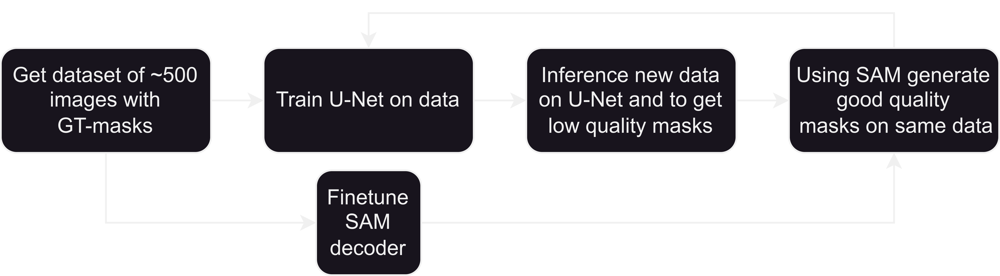
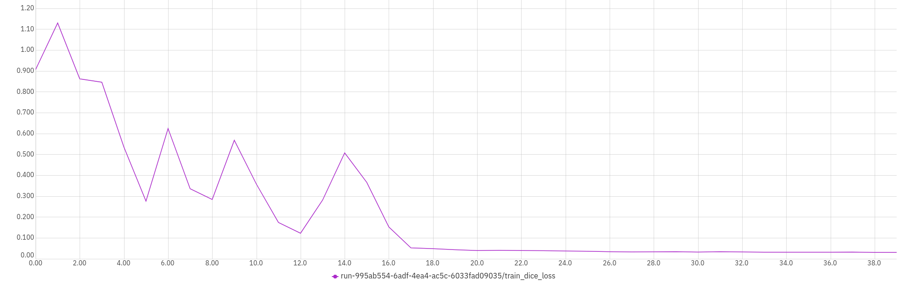
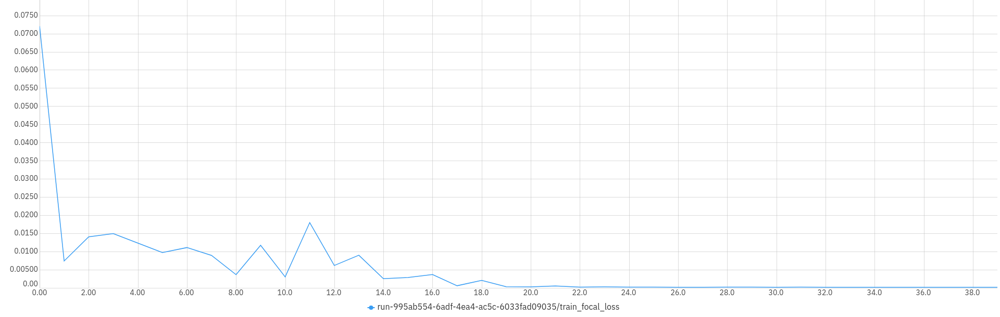
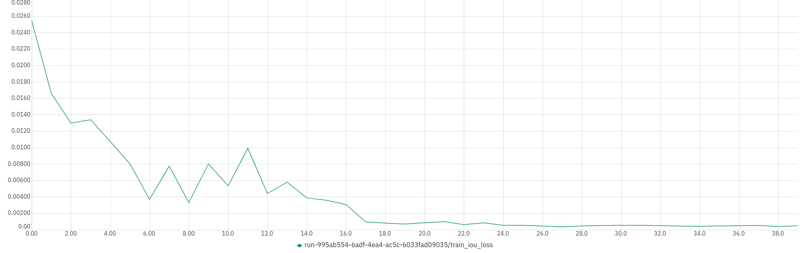
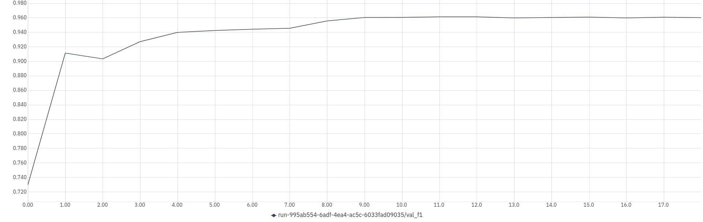
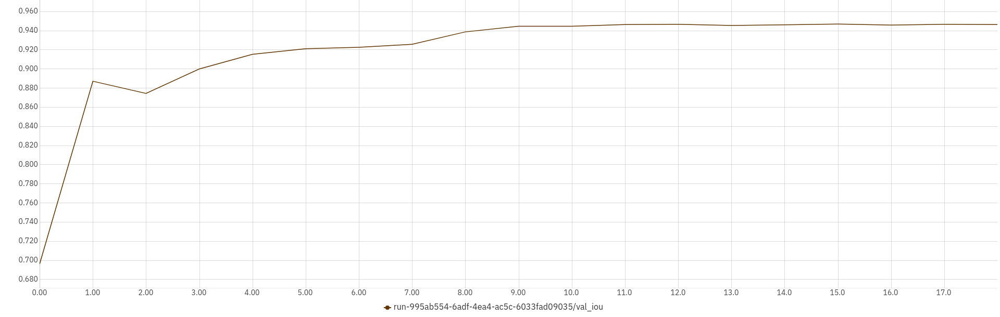

# Finetune SAM


The main task for this finetuning is to finetune the SAM model to segment your custom data based on promt bounding boxes. Further, this tool can autogenerate segmentation masks on unlabeled data via the following pipeline.



## Installation

```
git clone https://github.com/everguard-inc/segment_anything_tuning
cd segment_anything_tuning
conda create -n "fineSAM" python=3.9 -y
caonda activate fineSAM
pip install -r requirements.txt

```

## Quick Start

1. Prepare your custom dataset. The recommended structure should be the following
    ```
    ├── train
    │   ├── img
    │   │   ├── train_img1.jpeg
    │   │   ...
    │   └── masks
    │   │   ├── train_mask1.png
    │   │   ...
    ├── val
    │   ├── img
    │   │   ├── val_img1.jpeg
    │   │   ...
    │   └── masks
    │   │   ├── val_mask1.png
    │   │   ...
    ```
    Or any other, you anyway need to set a path to every of four dirs in `finetune_sam/config.py`.

2. Edit `finetune_sam/config.py` with your dataset paths. Also, check other params:cuda-devices-ID, out-path, etc.

3. Run ```finetune_sam/train.py```

4. To inference eg_dataset (in folder `segment_anything_tuning`; `fineSAM` - activated):
```
pwd # returns ..../segment_anything_tuning
export PYTHONPATH="${PYTHONPATH}:$(pwd)/finetune_sam"
python inference.py
```

## Features
- Supports custom datasets
- Performed caching of embeddings:
    - If embedding is not cached: 1-2 sec/img
    - If embedding cached: 0.2-0.4 sec/img
- Image preprocess encapsulated into the model. As input into the model, you must pass raw RGB image and promt bounding boxes for each image, both in patched form.
- Setuped Neptune for tracking training progress.

## Train plots
- train_dice_loss

- train_focal_loss

- train_iou_loss

- val_f1

- val_iou



## Results
Trained on tracks

| Class  |    IoU  | dice    | Epoch |
| ------ | ------- | ------- | ----- |
| crane  |         | 0.9166  |  0    |
| tent   |         |         |  0    |
| truck  | 0.6643  | 0.7808  |  0    |
| net    |         |         |  0    |
| total  | 0.6000  | 0.5659  |  0    |
| ------ | ------- | ------- | ----- |
| crane  |         | 0.9166  |  10   |
| tent   |         |         |  10   |
| truck  | 0.6643  | 0.7808  |  10   |
| net    |         |         |  10   |
| total  | 0.6000  | 0.5659  |  10   |
| ------ | ------- | ------- | ----- |
| crane  |         | 0.9166  |  20   |
| tent   |         |         |  20   |
| truck  | 0.6643  | 0.7808  |  20   |
| net    |         |         |  20   |
| total  | 0.6000  | 0.5659  |  20   |


# TODO
- For generating bounding boxes from text and prompt them to SAM, you may check: [lang-segment-anything](https://github.com/luca-medeiros/lang-segment-anything)
- Add noise to promt boxes for better adapting for low-quality promts.
- Add training on different classes simultaneously.


## Resources
- [Segment Anything](https://github.com/facebookresearch/segment-anything)
- [Lightning AI](https://github.com/Lightning-AI/lightning)
- [Lightning Segment-Anything Model](https://github.com/luca-medeiros/lightning-sam)

## License
This project is licensed the same as the SAM model.

## Notes
- Uses the original implementation of SAM.
- Loss calculated as stated on the paper (20 * focal loss + dice loss + mse loss).
- Only supports bounding box input prompts.